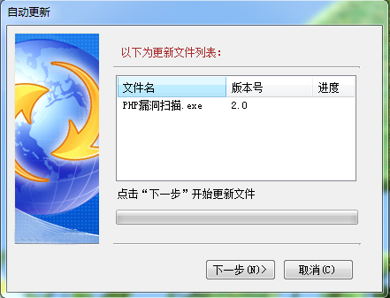

# 在线更新程序
### 开发语言：C#
### 开发工具：Microsoft Visual Studio 2010
## 软件简述：
在线更新程序是一款简单的程序自动更新或升级的软件，通过它可以方便地进行软件自动更新或应用程序升级。
## 使用说明：
1. 本地更新程序所在目录的UpdateList.xml代码如下：
```xml
<?xml version="1.0" encoding="gb2312"?>
<AutoUpdater>
  <description>Application autoUpdate</description>
  <Updater>
    <Url>服务器更新链接，例如 http://zy13.net/</Url>
	<LastUpdateTime>2020-10-5</LastUpdateTime>
  </Updater>
  <Application>
     <EntryPoint>当前主程序名称，例如 php漏洞扫描器.exe</EntryPoint>
  </Application>
  <Files>
	   <File Ver="文件版本号，例如 1.0" Name="文件名称" />
  </Files>
</AutoUpdater>
```
1. 服务器更新链接的UpdateList.xml代码如下：
```xml
<?xml version="1.0" encoding="gb2312"?>
<AutoUpdater>
  <description>Application autoUpdate</description>
  <Updater>
    <Url>服务器更新链接，例如 http://zy13.net/</Url>
	<LastUpdateTime>2020-11-5</LastUpdateTime>
  </Updater>
  <Application>
     <EntryPoint>当前主程序名称，例如 php漏洞扫描器.exe</EntryPoint>
  </Application>
  <Files>
	   <File Ver="文件版本号，例如 2.0" Name="要更新的文件名称" />
  </Files>
</AutoUpdater>
```
## 软件截图：

